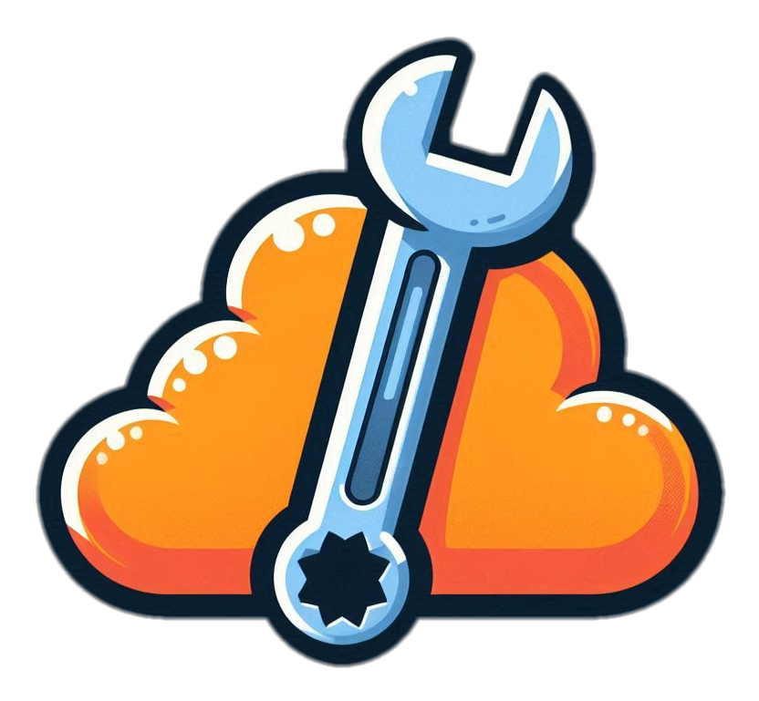

<h1 align="center">
  <br>
  
  <br>
  Cloudflare script
  <br>
</h1>

<h4 align="center">A simple CLI tool that allow to run local scripts that can access your Worker bindings</h4>

<p align="center">
  <a href="https://badge.fury.io/js/cf-script">
    
  </a>

</p>


## What is this ?

When working with cloudflare worker and cloudflare platform locally we don't have any easy way to directly access
Worker bindings such has (kv, r2, d1, ...).

This is by the nature of the secure cloudflare design where the bindings are provided to the app and not directly accessible.

So cf-script allow to run piece of code (scripts) that have access to your local cloudflare worker bindings. This can allow you to:

- Run one time sql query against your D1 database
- List, debug, write value in your KV database
- Download a file from your R2 bucket

## How To Use

### 1. Install

```bash
npm install cf-script # For local project install

# or

npm install cf-script -g # For global install
```

### 2. Write your first script

In order to write script you need to create a new file either (.ts or .js) and make it export by default a function

```ts
export default (env, args) => {
  console.log("Running script with following bindings ", env)
  console.log("And following args ", args)
}
```

### 3. Run your script

```bash
cf-script ./scripts/my-first-script.ts
```

And that it 🎉

You can check examples in the `/dogfood` folder (including one using typescript)

## CLI args

| Name | Description | Default | Example |
| --- | --- | --- | --- |
| `--env` | Environment to run the script in | undefined (default wrangler env) | --env staging |
| `--wcp` | Path to the wrangler config file | undefined (by default it will look for the closest one from cwd) | --wcp ./wrangler.toml |
| `--cwd` | Current working directory | process.cwd() | --cwd ./my-project |
| `--sa` | Args that will be passed to the executed script | undefined (no args) | --sa foo:bar or --sa foo:bar biz:baz |
| `--erb` | Enable experimental remote binding support | false | --experimental-remote-binding |

## Credits

This software uses the following open source packages:

- [jiti](https://github.com/unjs/jiti)
- [wrangler](https://github.com/cloudflare/workers-sdk)
- [commander](https://github.com/tj/commander.js)
- [ora](https://github.com/sindresorhus/ora)
- [vitest](https://github.com/vitest-dev/vitest)
- [biome](https://github.com/biomejs/biome)
- [tsup](https://github.com/egoist/tsup)

## License

MIT

---

> GitHub [@Thomascogez](https://github.com/Thomascogez) &nbsp;&middot;&nbsp;
> X [@Thomascogez](https://x.com/ThomasCogez)
